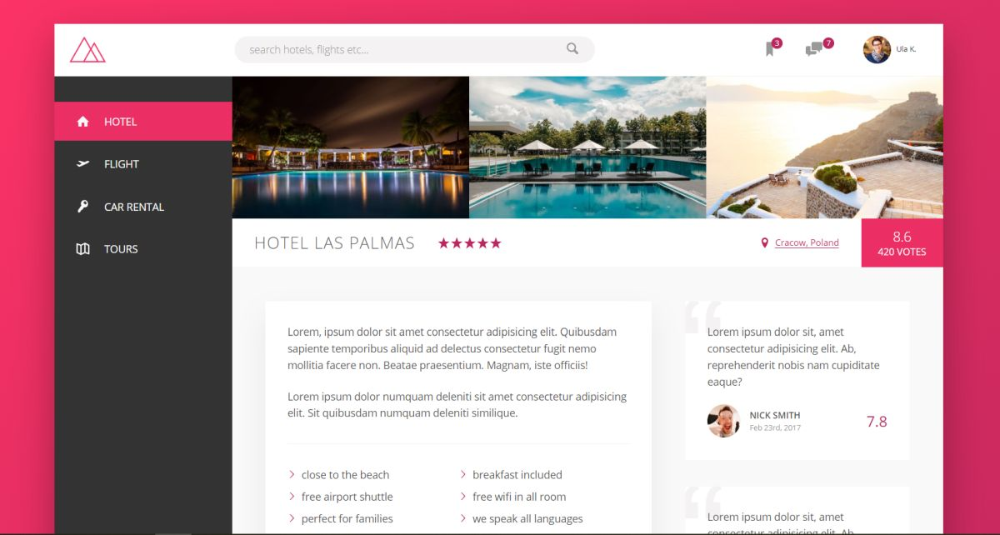
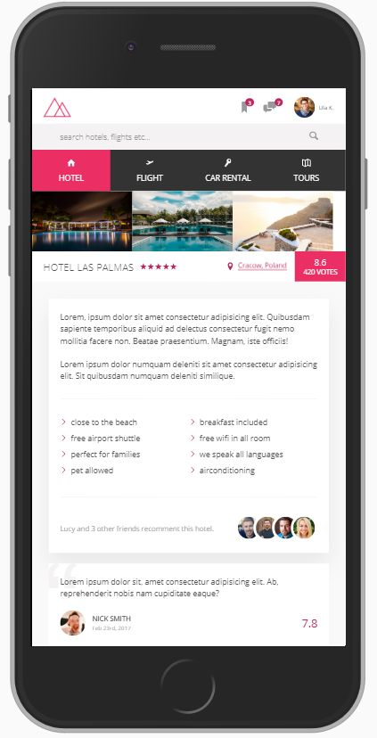
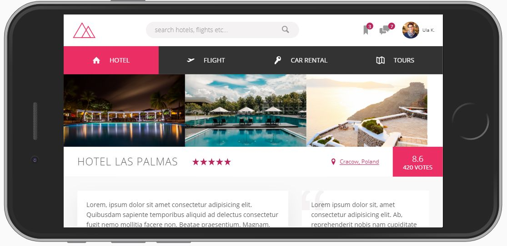

# TRILLO 
## BEST BOOKING PLACE!

**If you want to try it out, click here: [Natours webpage](https://ulakrawczyk.github.io/trillo/)**

### This is a simple webpage created during the Udemy course to practise css flex-box:
* using different properties of flex-box to build overall layout and to position the elements on the page
* custom properties instead of sass variables
* adding svg icons and using sprite.svg
* animated buttons
* currentColors, mask-image

### Page is fully responsive using:
* media queries and correct units
* changing layout at certain breakpoints
* responsive images with resolution switching
* desktop first technique

#### Browser support was also considered (graceful degradation used).

#### To run my project locally, you need:

`npm install -g gulp-cli`

`npm install`

`gulp`
